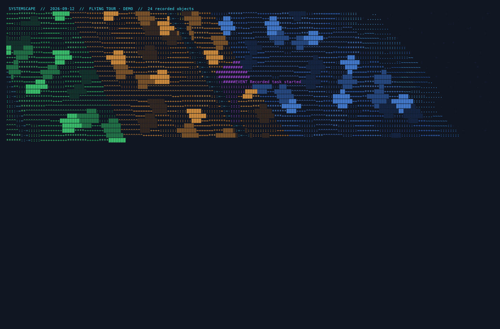
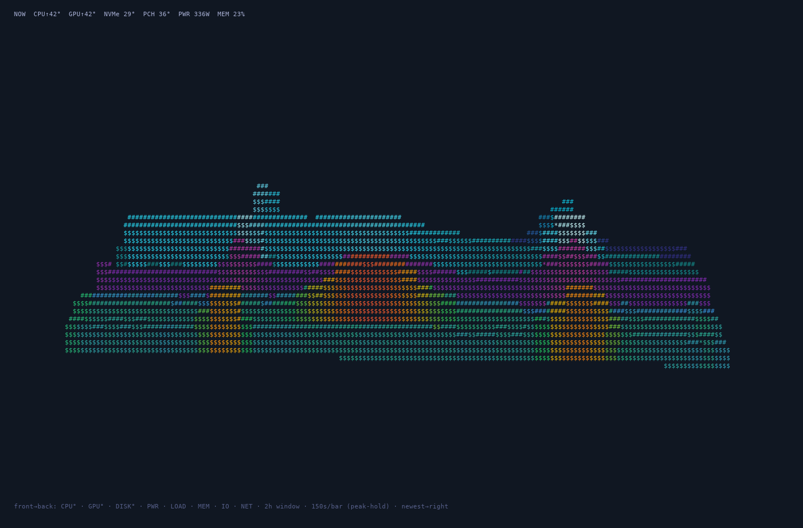
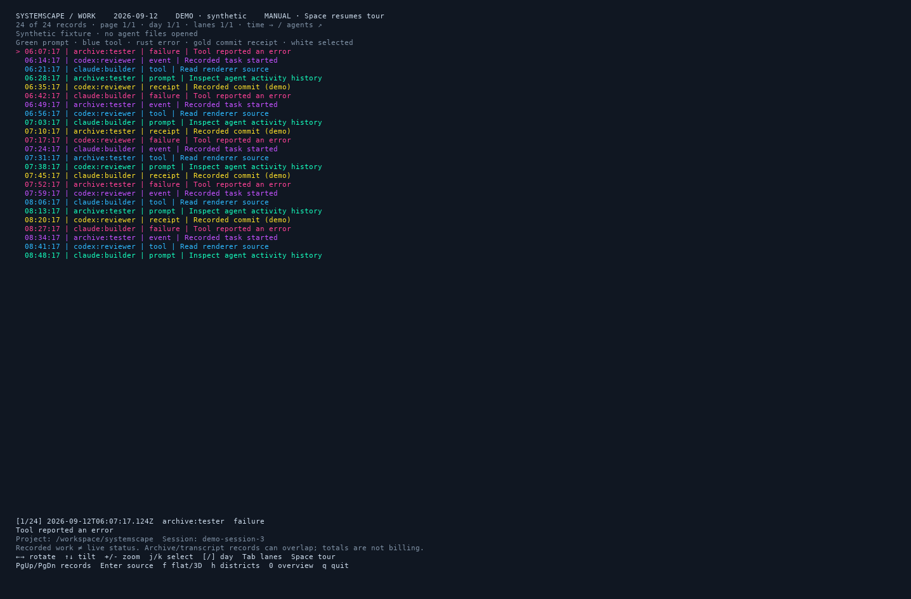

# SystemScape

**Interactive 3D system telemetry and agent work history for your terminal.**

SystemScape has two views: hardware telemetry shows what changed together;
agent activity shows who worked on what, with selectable records and their sources.
Both use [gemini-engine](https://github.com/renpenguin/gemini-engine) and run locally.
The repository was previously named `thermal3d`; the binary remains `systemscape`.

## Screenshots

These are captures of the running application in 200×65 tmux panes. Activity
uses synthetic records; telemetry uses a synthetic history with live NOW readings.

**Agent work in 3D** — a textured ASCII island holds time paths and agent
districts. Coloured beacons mark recorded actions; the selected record has a
bright callout and its details below.



**System telemetry** — eight history walls correlate temperatures, power, load,
memory, disk traffic and network traffic.



**Flat activity view** — press `f`, or shrink the pane below 80 columns or 25 rows.



To reproduce these captures, see [screenshots](docs/SCREENSHOTS.md).

## Agent activity

```sh
systemscape --activity          # local work history, interactive 3D
systemscape --activity --demo   # synthetic fixture; opens no agent histories
systemscape --activity --text   # readable day/project/agent/session records
systemscape --activity --json   # records plus coverage, for other local tools
```

Activity reads Claude Code and Codex session histories, including Claude
subagents and Agentbox profiles. It also reads Agentbox's shared event archive,
so any agent that emits there can appear, regardless of its harness. Agents
without a readable transcript or archived event are not visible.

The view groups records by UTC day, then lays agents out in depth over a
procedural island. Its glyph textures, coastline and relief provide a spatial
frame; they do not encode work metrics. Prompt stems
are taller than tool stems; height denotes record type, not cost or productivity.
Green marks prompts, blue tools, rust errors and gold recorded commit receipts.
The default tour flies rapidly through a landscape six times wider and deeper
than the original view. It completes a circuit in roughly thirteen seconds,
with a changing altitude of 30–46 world units and a forward-looking camera.
Tall neon gateways, information towers and varied glyph textures provide motion
and depth cues. Record selection advances every four seconds across pages,
agent districts and days. Nearby objects carry floating labels. Navigation
keys pause the tour; Space resumes it. Select a record to inspect its project,
session and source file. Lines describe
temporal grouping within sessions, not proven causal dependencies or git ancestry.

| Key | Action |
|-----|--------|
| Left / Right | Rotate |
| Up / Down | Tilt |
| `+` / `-` | Zoom |
| `j` / `k` | Next / previous record |
| `[` / `]` | Older / newer day |
| Tab | Next page of agent lanes |
| Page Up / Page Down | Older / newer page of records |
| Enter | Toggle source path / project and session |
| `f` | Switch between flat and 3D views |
| Space | Pause / resume the continuous flying tour |
| `0` | Pull back to an overview |
| `?` | Toggle detailed information and coverage |
| `h` | Toggle the agent district sidebar |
| `q`, Escape, Ctrl-C | Quit and restore the terminal |

No model calls, network requests, database or writes to source histories are
needed. The collector polls every two seconds and discovers files every 30 seconds.
It reads at most 1 MiB per file and 8 MiB per poll, tracks at most 256 files and
retains 5,000 records. The scene shows eight lanes and 128 records per page.
The full-screen tour targets 18 frames per second and supports panes up to
512 columns × 180 rows. This deliberately spends more CPU on smooth motion and
rich terrain. Large panels are hidden by default; `?` restores details and
coverage, and `h` restores the district sidebar. Once paused, the view redraws only when
data, controls or pane size change. The application keeps reading new work while
you explore manually.

Coverage reports pending files, omitted files, malformed input and truncated
history. One-shot text/JSON output performs one bounded poll, so check that
coverage before treating it as a complete export. Archives and transcripts can
describe the same work; their counts are not additive measures of completed tasks
or token spend. Commit receipts report what the transcript recorded and are not
checked against current git reachability. Prompt excerpts are limited to 240
characters; use the source file for the full record.

See [input formats and limits](docs/ACTIVITY.md) for paths, overrides and replay handling.

## System telemetry

SystemScape renders host telemetry as a field of 3D histogram walls, drawn
entirely with ANSI escape codes using
[gemini-engine](https://github.com/renpenguin/gemini-engine) (the renderer
behind [display3d](https://github.com/renpenguin/display3d)). Each telemetry
class is a right-to-left scrolling wall of bars; walls are stacked into the
depth axis and the whole scene rotates continuously through 360°, so a peak
in one class can be visually lined up with its cause in another. Aggregate
disk and network throughput reveal whether heat and load came from compute,
storage, or traffic.

```
 NOW  CPU↑39°  GPU↑52°  NVMe 28°  PWR 257W  LOAD 2%  MEM 13%  IO 824MB/s  NET 91MB/s
```

## Telemetry classes

| Wall  | Source | Aggregation |
|-------|--------|-------------|
| CPU°  | `coretemp` hwmon (all sockets, packages + cores) | max |
| GPU°  | `nvidia-smi` (all cards) | max |
| DISK° | `nvme` hwmon composite | — |
| PWR   | ACPI `power_meter` (whole-system watts) | — |
| LOAD  | `/proc/stat` busy % | — |
| MEM   | `/proc/meminfo` used % | — |
| IO    | `/proc/diskstats`, aggregate physical-disk reads + writes | MB/s |
| NET   | `/proc/net/dev`, aggregate RX + TX excluding loopback | MB/s |

The NOW bar additionally reports PCH and NIC (`ixgbe`) temperatures.
Missing sources degrade gracefully — a wall simply doesn't appear.

## Design

- **2-hour window**: 48 bars × 150 s per bar, newest at the right edge.
- **Peak-hold downsampling**: sensors are polled every 2 s and each bar
  commits the *maximum* seen in its 150 s slot, so short spikes survive
  decimation — the whole point of a correlation display.
- **Colour = value**: thermals run blue→green→yellow→red, power runs
  purple→pink, load/memory teal→white, throughput indigo→cyan→white,
  all as 24-bit ANSI colour.
- **Live resize**: the canvas follows the terminal size every frame.
- **Render rate**: telemetry runs at 10 FPS; CPU usage depends on pane size and sensor tools.

## Build & run

```sh
cargo build --release
./target/release/systemscape          # live telemetry
./target/release/systemscape --demo   # prefill 2 h of synthetic, correlated data
./target/release/systemscape --activity
```

Requires Linux (`/sys/class/hwmon`, `/proc`) and a truecolour terminal.
`nvidia-smi` on PATH enables the GPU wall.

`--demo` fills every wall with a deterministic synthetic story — two load
bursts that drag CPU temperature and power with them, an independent
mid-window GPU job that pulls disk temperature along, and a memory ramp —
useful for checking the full visual without waiting two hours.

Space pauses telemetry rotation, Left/Right adjusts its angle, and `q` quits.

## tmux integration

```sh
tmux new-window -n System 'while true; do /path/to/systemscape; sleep 2; done'
tmux split-window -h -p 38 'btm --basic'
tmux new-window -n Activity 'systemscape --activity'
```

The 3D pane answers “what moved together over time?” while the companion pane
attributes the current event to processes, cores, disks, and interfaces.

## Containers

SystemScape is designed to work as an immutable image package. Run it inside
the container so `/proc` reflects the container-visible system view. GPU
telemetry requires `nvidia-smi` plus the NVIDIA runtime/device mapping;
hardware temperatures depend on which `/sys/class/hwmon` entries the runtime
exposes. Missing sources degrade gracefully. Disk and network rates derive
from container-visible `/proc/diskstats` and `/proc/net/dev` counters.

[DreamLab Agentbox](https://github.com/DreamLab-AI/agentbox) bakes SystemScape
into its Nix-built runtime. The System pane keeps `btm` alongside for live
attribution; the Activity window runs `systemscape --activity`.

## Tuning

Telemetry settings are constants at the top of `src/main.rs`:

| Constant | Meaning | Default |
|----------|---------|---------|
| `SLOT_SECS` | seconds per history bar (window = 48 × this) | 150 (2 h) |
| `HISTORY` | bars per wall | 48 |
| `SPIN` | rotation speed, rad/frame | 0.008 (~78 s/rev) |
| `POLL_FRAMES` | frames between sensor polls | 20 (2 s) |
| `FPS` | render rate | 10 |

Camera angle lives in the `Viewport::new` call in `main()`.

## License

Apache-2.0. See [LICENSE](LICENSE). The agent-work view takes inspiration from
[bough](https://github.com/nickelsec/bough), an MIT-licensed local work-history
visualiser. This is an independent Rust implementation; no bough code is bundled.
