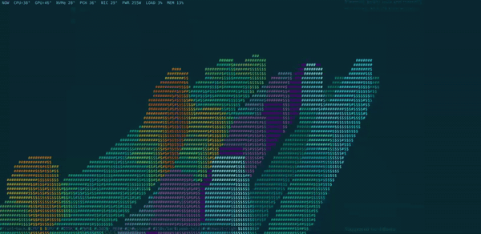

# SystemScape

**Scrolling 3D telemetry history for your terminal.**



> Hero GIF pending — see [docs/HERO_GIF.md](docs/HERO_GIF.md) for capture notes and a ready-made VHS tape.

SystemScape renders host telemetry as a field of 3D histogram walls, drawn
entirely with ANSI escape codes using
[gemini-engine](https://github.com/renpenguin/gemini-engine) (the renderer
behind [display3d](https://github.com/renpenguin/display3d)). Each telemetry
class is a right-to-left scrolling wall of bars; walls are stacked into the
depth axis and the whole scene rotates continuously through 360°, so a peak
in one class can be visually lined up with its cause in another. Aggregate
disk and network throughput reveal whether heat and load came from compute,
storage, or traffic.

```
 NOW  CPU↑39°  GPU↑52°  NVMe 28°  PWR 257W  LOAD 2%  MEM 13%  IO 824MB/s  NET 91MB/s
```

## Telemetry classes

| Wall  | Source | Aggregation |
|-------|--------|-------------|
| CPU°  | `coretemp` hwmon (all sockets, packages + cores) | max |
| GPU°  | `nvidia-smi` (all cards) | max |
| DISK° | `nvme` hwmon composite | — |
| PWR   | ACPI `power_meter` (whole-system watts) | — |
| LOAD  | `/proc/stat` busy % | — |
| MEM   | `/proc/meminfo` used % | — |
| IO    | `/proc/diskstats`, aggregate physical-disk reads + writes | MB/s |
| NET   | `/proc/net/dev`, aggregate RX + TX excluding loopback | MB/s |

The NOW bar additionally reports PCH and NIC (`ixgbe`) temperatures.
Missing sources degrade gracefully — a wall simply doesn't appear.

## Design

- **2-hour window**: 48 bars × 150 s per bar, newest at the right edge.
- **Peak-hold downsampling**: sensors are polled every 2 s and each bar
  commits the *maximum* seen in its 150 s slot, so short spikes survive
  decimation — the whole point of a correlation display.
- **Colour = value**: thermals run blue→green→yellow→red, power runs
  purple→pink, load/memory teal→white, throughput indigo→cyan→white,
  all as 24-bit ANSI colour.
- **Live resize**: the canvas follows the terminal size every frame.
- **Cheap**: ~2 % of one core at 10 FPS.

## Build & run

```sh
cargo build --release
./target/release/systemscape          # live telemetry
./target/release/systemscape --demo   # prefill 2 h of synthetic, correlated data
```

Requires Linux (`/sys/class/hwmon`, `/proc`) and a truecolour terminal.
`nvidia-smi` on PATH enables the GPU wall.

`--demo` fills every wall with a deterministic synthetic story — two load
bursts that drag CPU temperature and power with them, an independent
mid-window GPU job that pulls disk temperature along, and a memory ramp —
useful for checking the full visual without waiting two hours.

## tmux integration

```sh
tmux new-window -n System 'while true; do /path/to/systemscape; sleep 2; done'
tmux split-window -h -p 38 'btm --basic'
```

The 3D pane answers “what moved together over time?” while the companion pane
attributes the current event to processes, cores, disks, and interfaces.

## Containers

SystemScape is designed to work as an immutable image package. Run it inside
the container so `/proc` reflects the container-visible system view. GPU
telemetry requires `nvidia-smi` plus the NVIDIA runtime/device mapping;
hardware temperatures depend on which `/sys/class/hwmon` entries the runtime
exposes. Missing sources degrade gracefully. Disk and network rates derive
from container-visible `/proc/diskstats` and `/proc/net/dev` counters.

[DreamLab Agentbox](https://github.com/DreamLab-AI/agentbox) bakes SystemScape
into its Nix-built runtime and uses it as the primary tmux System pane, with
`btm` alongside for live attribution.

## Tuning

Everything interesting is a constant at the top of `src/main.rs`:

| Constant | Meaning | Default |
|----------|---------|---------|
| `SLOT_SECS` | seconds per history bar (window = 48 × this) | 150 (2 h) |
| `HISTORY` | bars per wall | 48 |
| `SPIN` | rotation speed, rad/frame | 0.008 (~78 s/rev) |
| `POLL_FRAMES` | frames between sensor polls | 20 (2 s) |
| `FPS` | render rate | 10 |

Camera angle lives in the `Viewport::new` call in `main()`.

## License

Apache-2.0. See [LICENSE](LICENSE).
